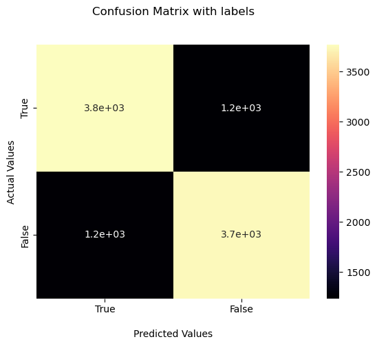
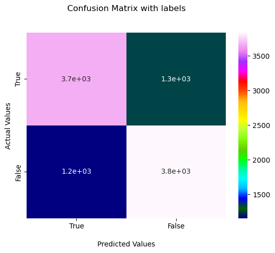
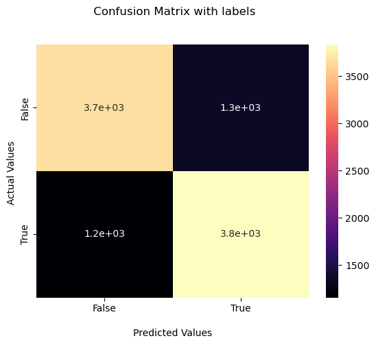
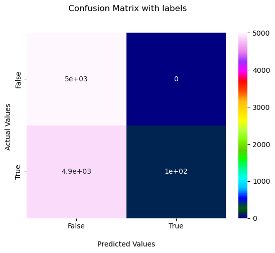
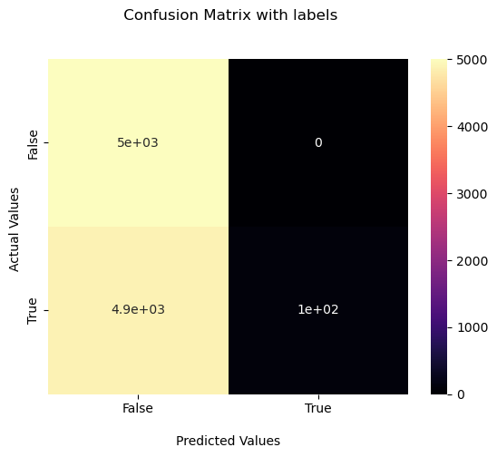
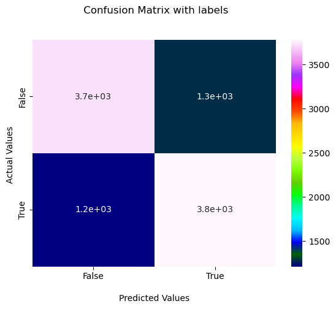
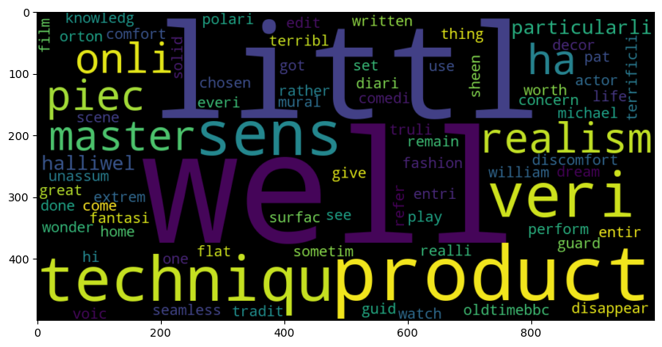
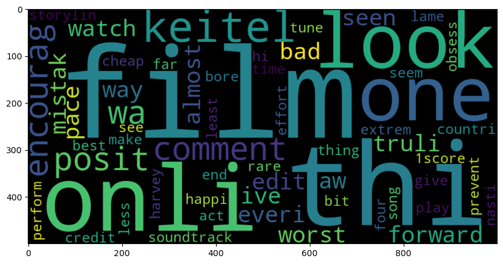

Importing Libraries


```python

import numpy as np
import pandas as pd
import seaborn as sns
import matplotlib.pyplot as plt
import nltk
from sklearn.feature_extraction.text import CountVectorizer
from sklearn.feature_extraction.text import TfidfVectorizer
from sklearn.preprocessing import LabelBinarizer
from nltk.corpus import stopwords
from nltk.stem.porter import PorterStemmer
from wordcloud import WordCloud,STOPWORDS
from nltk.stem import WordNetLemmatizer
from nltk.tokenize import word_tokenize,sent_tokenize
from bs4 import BeautifulSoup
import spacy
import re,string,unicodedata
from nltk.tokenize.toktok import ToktokTokenizer
from nltk.stem import LancasterStemmer,WordNetLemmatizer
from sklearn.linear_model import LogisticRegression,SGDClassifier
from sklearn.naive_bayes import MultinomialNB
from sklearn.svm import SVC
from textblob import TextBlob
from textblob import Word
from sklearn.metrics import classification_report,confusion_matrix,accuracy_score
```

Importing Dataset


```python

file_path = r"C:\Users\JITENDRA\Downloads\IMDB Dataset.csv"
imdb_data = pd.read_csv(file_path)

imdb_data.shape
imdb_data.head(10)
```


<div>
<style scoped>
    .dataframe tbody tr th:only-of-type {
        vertical-align: middle;
    }

    .dataframe tbody tr th {
        vertical-align: top;
    }

    .dataframe thead th {
        text-align: right;
    }
</style>
<table border="1" class="dataframe">
  <thead>
    <tr style="text-align: right;">
      <th></th>
      <th>review</th>
      <th>sentiment</th>
    </tr>
  </thead>
  <tbody>
    <tr>
      <th>0</th>
      <td>One of the other reviewers has mentioned that ...</td>
      <td>positive</td>
    </tr>
    <tr>
      <th>1</th>
      <td>A wonderful little production. &lt;br /&gt;&lt;br /&gt;The...</td>
      <td>positive</td>
    </tr>
    <tr>
      <th>2</th>
      <td>I thought this was a wonderful way to spend ti...</td>
      <td>positive</td>
    </tr>
    <tr>
      <th>3</th>
      <td>Basically there's a family where a little boy ...</td>
      <td>negative</td>
    </tr>
    <tr>
      <th>4</th>
      <td>Petter Mattei's "Love in the Time of Money" is...</td>
      <td>positive</td>
    </tr>
    <tr>
      <th>5</th>
      <td>Probably my all-time favorite movie, a story o...</td>
      <td>positive</td>
    </tr>
    <tr>
      <th>6</th>
      <td>I sure would like to see a resurrection of a u...</td>
      <td>positive</td>
    </tr>
    <tr>
      <th>7</th>
      <td>This show was an amazing, fresh &amp; innovative i...</td>
      <td>negative</td>
    </tr>
    <tr>
      <th>8</th>
      <td>Encouraged by the positive comments about this...</td>
      <td>negative</td>
    </tr>
    <tr>
      <th>9</th>
      <td>If you like original gut wrenching laughter yo...</td>
      <td>positive</td>
    </tr>
  </tbody>
</table>
</div>


Exploratory Data Analysis


```python
imdb_data.describe()
```


<div>
<style scoped>
    .dataframe tbody tr th:only-of-type {
        vertical-align: middle;
    }

    .dataframe tbody tr th {
        vertical-align: top;
    }

    .dataframe thead th {
        text-align: right;
    }
</style>
<table border="1" class="dataframe">
  <thead>
    <tr style="text-align: right;">
      <th></th>
      <th>review</th>
      <th>sentiment</th>
    </tr>
  </thead>
  <tbody>
    <tr>
      <th>count</th>
      <td>50000</td>
      <td>50000</td>
    </tr>
    <tr>
      <th>unique</th>
      <td>49582</td>
      <td>2</td>
    </tr>
    <tr>
      <th>top</th>
      <td>Loved today's show!!! It was a variety and not...</td>
      <td>positive</td>
    </tr>
    <tr>
      <th>freq</th>
      <td>5</td>
      <td>25000</td>
    </tr>
  </tbody>
</table>
</div>


```python
imdb_data.info()
```

    <class 'pandas.core.frame.DataFrame'>
    RangeIndex: 50000 entries, 0 to 49999
    Data columns (total 2 columns):
     #   Column     Non-Null Count  Dtype 
    ---  ------     --------------  ----- 
     0   review     50000 non-null  object
     1   sentiment  50000 non-null  object
    dtypes: object(2)
    memory usage: 781.4+ KB
    


```python
imdb_data['sentiment'].value_counts()
```


    positive    25000
    negative    25000
    Name: sentiment, dtype: int64


Splitting Training Data


```python

#train dataset
train_reviews=imdb_data.review[:40000]
train_sentiments=imdb_data.sentiment[:40000]
#test dataset
test_reviews=imdb_data.review[40000:]
test_sentiments=imdb_data.sentiment[40000:]
print(train_reviews.shape,train_sentiments.shape)
print(test_reviews.shape,test_sentiments.shape)
```

    (40000,) (40000,)
    (10000,) (10000,)
    

Text normalization


```python
#Tokenization of text
tokenizer=ToktokTokenizer()

#Setting English stopwords

nltk.download('stopwords')
stopword_list=nltk.corpus.stopwords.words('english')
```

    [nltk_data] Downloading package stopwords to
    [nltk_data]     C:\Users\JITENDRA\AppData\Roaming\nltk_data...
    [nltk_data]   Package stopwords is already up-to-date!
    

Removing html strips and noise from text


```python
#Removing the html strips
def strip_html(text):
    soup = BeautifulSoup(text, "html.parser")
    return soup.get_text()

#Removing the square brackets
def remove_between_square_brackets(text):
    return re.sub('\[[^]]*\]', '', text)

#Removing the noisy text
def denoise_text(text):
    text = strip_html(text)
    text = remove_between_square_brackets(text)
    return text
#Apply function on review column
imdb_data['review']=imdb_data['review'].apply(denoise_text)
```

    C:\Users\JITENDRA\anaconda3\lib\site-packages\bs4\__init__.py:435: MarkupResemblesLocatorWarning: The input looks more like a filename than markup. You may want to open this file and pass the filehandle into Beautiful Soup.
      warnings.warn(
    

Removing special characters


```python
#Define function for removing special characters
def remove_special_characters(text, remove_digits=True):
    pattern=r'[^a-zA-z0-9\s]'
    text=re.sub(pattern,'',text)
    return text
#Apply function on review column
imdb_data['review']=imdb_data['review'].apply(remove_special_characters)
```

Text stemming


```python
#Stemming the text
def simple_stemmer(text):
    ps=nltk.porter.PorterStemmer()
    text= ' '.join([ps.stem(word) for word in text.split()])
    return text
#Apply function on review column
imdb_data['review']=imdb_data['review'].apply(simple_stemmer)
```

Removing stopwords


```python
#set stopwords to english
stop=set(stopwords.words('english'))
print(stop)

```

    {'a', 'wouldn', 'until', 'the', 'what', 'those', 'so', 'yourselves', 'not', 'was', 'each', 'all', 'hadn', 'wasn', 'then', 'an', 'its', 'will', 'she', 's', "you've", 'i', 'than', "don't", 'm', 'her', "weren't", "haven't", 'for', 'too', 'during', 'further', 'ain', 'where', "doesn't", 'any', 'you', 'when', 'down', 'but', 'why', "you'd", 'once', 'while', "she's", "you're", 'same', 'couldn', 'my', "hasn't", 'were', 'them', 'shan', "that'll", 'above', 'o', "shouldn't", 'doing', 'aren', 'theirs', 'from', 'be', 'with', 'just', 'being', 've', 'our', 't', 'weren', 'both', 'doesn', 'as', 'isn', 'at', "mustn't", 'itself', 'under', 'having', 'll', 'yours', 'ourselves', 'been', 'over', 'some', 'who', 'can', 'against', 'does', 'it', 'which', 'ours', 'few', 'only', 'off', 'shouldn', 'here', 'by', 'this', 'd', "hadn't", 'your', 'whom', 'of', "needn't", 'have', 'did', 'because', 'own', "couldn't", 'that', 'me', 'yourself', 'such', "didn't", 'no', "aren't", "you'll", 'hers', 'or', 'most', 'don', 'after', 'hasn', "won't", 'has', 'ma', 'needn', 'there', 'other', "shan't", 'am', 'to', 'on', 'nor', 'didn', "isn't", 're', 'into', 'again', 'are', 'herself', 'had', 'very', "should've", 'him', 'we', 'between', 'about', 'how', 'below', 'now', 'is', "wasn't", 'themselves', 'himself', 'these', 'mightn', 'myself', 'won', 'his', 'do', "mightn't", 'through', 'out', 'mustn', 'should', 'they', 'in', 'and', "wouldn't", "it's", 'up', 'y', 'if', 'before', 'their', 'haven', 'more', 'he'}
    


```python
#removing the stopwords
def remove_stopwords(text, is_lower_case=False):
    tokens = tokenizer.tokenize(text)
    tokens = [token.strip() for token in tokens]
    if is_lower_case:
        filtered_tokens = [token for token in tokens if token not in stopword_list]
    else:
        filtered_tokens = [token for token in tokens if token.lower() not in stopword_list]
    filtered_text = ' '.join(filtered_tokens)    
    return filtered_text
#Apply function on review column
imdb_data['review']=imdb_data['review'].apply(remove_stopwords)
```

Normalized train reviews


```python
#normalized train reviews
norm_train_reviews=imdb_data.review[:40000]
norm_train_reviews[0]
```


    'one review ha mention watch 1 oz episod youll hook right thi exactli happen meth first thing struck oz wa brutal unflinch scene violenc set right word go trust thi show faint heart timid thi show pull punch regard drug sex violenc hardcor classic use wordit call oz nicknam given oswald maximum secur state penitentari focus mainli emerald citi experiment section prison cell glass front face inward privaci high agenda em citi home manyaryan muslim gangsta latino christian italian irish moreso scuffl death stare dodgi deal shadi agreement never far awayi would say main appeal show due fact goe show wouldnt dare forget pretti pictur paint mainstream audienc forget charm forget romanceoz doesnt mess around first episod ever saw struck nasti wa surreal couldnt say wa readi watch develop tast oz got accustom high level graphic violenc violenc injustic crook guard wholl sold nickel inmat wholl kill order get away well manner middl class inmat turn prison bitch due lack street skill prison experi watch oz may becom comfort uncomfort viewingthat get touch darker side'


Normalized test reviews


```python
norm_test_reviews=imdb_data.review[40000:]
norm_test_reviews[45005]
```


    'read review watch thi piec cinemat garbag took least 2 page find somebodi els didnt think thi appallingli unfunni montag wasnt acm humour 70 inde ani era thi isnt least funni set sketch comedi ive ever seen itll till come along half skit alreadi done infinit better act monti python woodi allen wa say nice piec anim last 90 second highlight thi film would still get close sum mindless drivelridden thi wast 75 minut semin comedi onli world semin realli doe mean semen scatolog humour onli world scat actual fece precursor joke onli mean thi handbook comedi tit bum odd beaver niceif pubesc boy least one hand free havent found playboy exist give break becaus wa earli 70 way sketch comedi go back least ten year prior onli way could even forgiv thi film even made wa gunpoint retro hardli sketch clown subtli pervert children may cut edg circl could actual funni come realli quit sad kept go throughout entir 75 minut sheer belief may save genuin funni skit end gave film 1 becaus wa lower scoreand onli recommend insomniac coma patientsor perhap peopl suffer lockjawtheir jaw would final drop open disbelief'


**Bags of words model**

It is used to convert text documents to simple numerical vectors or bag of words.


```python
#Count vectorizer for bag of words
cv=CountVectorizer(min_df=0,max_df=1,binary=False,ngram_range=(1,3))
#transformed train reviews
cv_train_reviews=cv.fit_transform(norm_train_reviews)
#transformed test reviews
cv_test_reviews=cv.transform(norm_test_reviews)

print('BOW_cv_train:',cv_train_reviews.shape)
print('BOW_cv_test:',cv_test_reviews.shape)

```

    BOW_cv_train: (40000, 6209089)
    BOW_cv_test: (10000, 6209089)
    

**Term Frequency-Inverse Document Frequency model (TFIDF)**

It is used to convert text documents to matrix of tfidf features.


```python
#Tfidf vectorizer
tv=TfidfVectorizer(min_df=0,max_df=1,use_idf=True,ngram_range=(1,3))
#transformed train reviews
tv_train_reviews=tv.fit_transform(norm_train_reviews)
#transformed test reviews
tv_test_reviews=tv.transform(norm_test_reviews)
print('Tfidf_train:',tv_train_reviews.shape)
print('Tfidf_test:',tv_test_reviews.shape)
```

    Tfidf_train: (40000, 6209089)
    Tfidf_test: (10000, 6209089)
    

Labeling the sentiment text


```python
#labeling the sentient data
lb=LabelBinarizer()
#transformed sentiment data
sentiment_data=lb.fit_transform(imdb_data['sentiment'])
print(sentiment_data.shape)
```

    (50000, 1)
    

Split the sentiment tdata


```python
#Spliting the sentiment data
train_sentiments=sentiment_data[:40000]
test_sentiments=sentiment_data[40000:]
print(train_sentiments)
print(test_sentiments)
```

    [[1]
     [1]
     [1]
     ...
     [1]
     [0]
     [0]]
    [[0]
     [0]
     [0]
     ...
     [0]
     [0]
     [0]]
    

**Modelling the dataset**

Using logistic regression model for both bag of words and tfidf features


```python
#training the model
lr=LogisticRegression(penalty='l2',max_iter=500,C=1,random_state=42)
#Fitting the model for Bag of words
lr_bow=lr.fit(cv_train_reviews,train_sentiments)
print(lr_bow)
#Fitting the model for tfidf features
lr_tfidf=lr.fit(tv_train_reviews,train_sentiments)
print(lr_tfidf)
```

    C:\Users\JITENDRA\anaconda3\lib\site-packages\sklearn\utils\validation.py:1143: DataConversionWarning: A column-vector y was passed when a 1d array was expected. Please change the shape of y to (n_samples, ), for example using ravel().
      y = column_or_1d(y, warn=True)
    

    LogisticRegression(C=1, max_iter=500, random_state=42)
    

    C:\Users\JITENDRA\anaconda3\lib\site-packages\sklearn\utils\validation.py:1143: DataConversionWarning: A column-vector y was passed when a 1d array was expected. Please change the shape of y to (n_samples, ), for example using ravel().
      y = column_or_1d(y, warn=True)
    

    LogisticRegression(C=1, max_iter=500, random_state=42)
    

Logistic regression model performane on test dataset


```python
#Predicting the model for bag of words
lr_bow_predict=lr.predict(cv_test_reviews)
print(lr_bow_predict)
##Predicting the model for tfidf features
lr_tfidf_predict=lr.predict(tv_test_reviews)
print(lr_tfidf_predict)
```

    [0 0 0 ... 0 1 1]
    [0 0 0 ... 0 1 1]
    

Accuracy of the model


```python
#Accuracy score for bag of words
lr_bow_score=accuracy_score(test_sentiments,lr_bow_predict)
print("lr_bow_score :",lr_bow_score)
#Accuracy score for tfidf features
lr_tfidf_score=accuracy_score(test_sentiments,lr_tfidf_predict)
print("lr_tfidf_score :",lr_tfidf_score)
```

    lr_bow_score : 0.7512
    lr_tfidf_score : 0.75
    

Print the classification report


```python
#Classification report for bag of words 
lr_bow_report=classification_report(test_sentiments,lr_bow_predict,target_names=['Positive','Negative'])
print(lr_bow_report)

#Classification report for tfidf features
lr_tfidf_report=classification_report(test_sentiments,lr_tfidf_predict,target_names=['Positive','Negative'])
print(lr_tfidf_report)
```

                  precision    recall  f1-score   support
    
        Positive       0.75      0.75      0.75      4993
        Negative       0.75      0.75      0.75      5007
    
        accuracy                           0.75     10000
       macro avg       0.75      0.75      0.75     10000
    weighted avg       0.75      0.75      0.75     10000
    
                  precision    recall  f1-score   support
    
        Positive       0.74      0.77      0.75      4993
        Negative       0.76      0.73      0.75      5007
    
        accuracy                           0.75     10000
       macro avg       0.75      0.75      0.75     10000
    weighted avg       0.75      0.75      0.75     10000
    
    

Confusion matrix


```python
import seaborn as sns
import matplotlib.pyplot as plt
from sklearn.metrics import confusion_matrix

# Confusion matrix for bag of words
cm_bow = confusion_matrix(test_sentiments, lr_bow_predict, labels=[1, 0])
ax = sns.heatmap(cm_bow, annot=True, cmap='magma')

ax.set_title('Confusion Matrix with labels\n\n')
ax.set_xlabel('\nPredicted Values')
ax.set_ylabel('Actual Values')

# Ticket labels - List must be in alphabetical order
ax.xaxis.set_ticklabels(['True', 'False'])
ax.yaxis.set_ticklabels(['True', 'False'])

# Display the visualization of the Confusion Matrix.
plt.show()

# Confusion matrix for tfidf features
cm_tfidf = confusion_matrix(test_sentiments, lr_tfidf_predict, labels=[1, 0])
ax = sns.heatmap(cm_tfidf, annot=True, cmap='gist_ncar')

ax.set_title('Confusion Matrix with labels\n\n')
ax.set_xlabel('\nPredicted Values')
ax.set_ylabel('Actual Values')

# Ticket labels - List must be in alphabetical order
ax.xaxis.set_ticklabels(['True', 'False'])
ax.yaxis.set_ticklabels(['True', 'False'])

# Display the visualization of the Confusion Matrix.
plt.show()

```


    

    


    

    


**Stochastic gradient descent or Linear support vector machines for bag of words and tfidf features**


```python
#training the linear svm
svm=SGDClassifier(loss='hinge',max_iter=500,random_state=42)
#fitting the svm for bag of words
svm_bow=svm.fit(cv_train_reviews,train_sentiments)
print(svm_bow)
#fitting the svm for tfidf features
svm_tfidf=svm.fit(tv_train_reviews,train_sentiments)
print(svm_tfidf)
```

    C:\Users\JITENDRA\anaconda3\lib\site-packages\sklearn\utils\validation.py:1143: DataConversionWarning: A column-vector y was passed when a 1d array was expected. Please change the shape of y to (n_samples, ), for example using ravel().
      y = column_or_1d(y, warn=True)
    

    SGDClassifier(max_iter=500, random_state=42)
    

    C:\Users\JITENDRA\anaconda3\lib\site-packages\sklearn\utils\validation.py:1143: DataConversionWarning: A column-vector y was passed when a 1d array was expected. Please change the shape of y to (n_samples, ), for example using ravel().
      y = column_or_1d(y, warn=True)
    

    SGDClassifier(max_iter=500, random_state=42)
    

Model performance on test data


```python
#Predicting the model for bag of words
svm_bow_predict=svm.predict(cv_test_reviews)
print(svm_bow_predict)
#Predicting the model for tfidf features
svm_tfidf_predict=svm.predict(tv_test_reviews)
print(svm_tfidf_predict)
```

    [1 1 0 ... 1 1 1]
    [1 1 1 ... 1 1 1]
    

Accuracy of the model


```python
#Accuracy score for bag of words
svm_bow_score=accuracy_score(test_sentiments,svm_bow_predict)
print("svm_bow_score :",svm_bow_score)
#Accuracy score for tfidf features
svm_tfidf_score=accuracy_score(test_sentiments,svm_tfidf_predict)
print("svm_tfidf_score :",svm_tfidf_score)
```

    svm_bow_score : 0.5829
    svm_tfidf_score : 0.5112
    

Print the classification report


```python
#Classification report for bag of words 
svm_bow_report=classification_report(test_sentiments,svm_bow_predict,target_names=['Positive','Negative'])
print(svm_bow_report)
#Classification report for tfidf features
svm_tfidf_report=classification_report(test_sentiments,svm_tfidf_predict,target_names=['Positive','Negative'])
print(svm_tfidf_report)
```

                  precision    recall  f1-score   support
    
        Positive       0.94      0.18      0.30      4993
        Negative       0.55      0.99      0.70      5007
    
        accuracy                           0.58     10000
       macro avg       0.74      0.58      0.50     10000
    weighted avg       0.74      0.58      0.50     10000
    
                  precision    recall  f1-score   support
    
        Positive       1.00      0.02      0.04      4993
        Negative       0.51      1.00      0.67      5007
    
        accuracy                           0.51     10000
       macro avg       0.75      0.51      0.36     10000
    weighted avg       0.75      0.51      0.36     10000
    
    

Plot the confusion matrix


```python
#confusion matrix for bag of words
cm_bow=confusion_matrix(test_sentiments,svm_bow_predict,labels=[1,0])
ax = sns.heatmap(cm_tfidf, annot=True, cmap='magma')

ax.set_title(' Confusion Matrix with labels\n\n');
ax.set_xlabel('\nPredicted Values')
ax.set_ylabel('Actual Values ');

## Ticket labels - List must be in alphabetical order
ax.xaxis.set_ticklabels(['False','True'])
ax.yaxis.set_ticklabels(['False','True'])

## Display the visualization of the Confusion Matrix.
plt.show()


#confusion matrix for tfidf features
cm_tfidf=confusion_matrix(test_sentiments,svm_tfidf_predict,labels=[1,0])
ax = sns.heatmap(cm_tfidf, annot=True, cmap='gist_ncar')

ax.set_title(' Confusion Matrix with labels\n\n');
ax.set_xlabel('\nPredicted Values')
ax.set_ylabel('Actual Values ');

## Ticket labels - List must be in alphabetical order
ax.xaxis.set_ticklabels(['False','True'])
ax.yaxis.set_ticklabels(['False','True'])

## Display the visualization of the Confusion Matrix.
plt.show()
```


    

    


    

    


**Multinomial Naive Bayes for bag of words and tfidf features**


```python
#training the model
mnb=MultinomialNB()
#fitting the svm for bag of words
mnb_bow=mnb.fit(cv_train_reviews,train_sentiments)
print(mnb_bow)
#fitting the svm for tfidf features
mnb_tfidf=mnb.fit(tv_train_reviews,train_sentiments)
print(mnb_tfidf)
```

    C:\Users\JITENDRA\anaconda3\lib\site-packages\sklearn\utils\validation.py:1143: DataConversionWarning: A column-vector y was passed when a 1d array was expected. Please change the shape of y to (n_samples, ), for example using ravel().
      y = column_or_1d(y, warn=True)
    

    MultinomialNB()
    

    C:\Users\JITENDRA\anaconda3\lib\site-packages\sklearn\utils\validation.py:1143: DataConversionWarning: A column-vector y was passed when a 1d array was expected. Please change the shape of y to (n_samples, ), for example using ravel().
      y = column_or_1d(y, warn=True)
    

    MultinomialNB()
    

Model performance on test data


```python
#Predicting the model for bag of words
mnb_bow_predict=mnb.predict(cv_test_reviews)
print(mnb_bow_predict)
#Predicting the model for tfidf features
mnb_tfidf_predict=mnb.predict(tv_test_reviews)
print(mnb_tfidf_predict)
```

    [0 0 0 ... 0 1 1]
    [0 0 0 ... 0 1 1]
    

Accuracy of the model


```python
#Accuracy score for bag of words
mnb_bow_score=accuracy_score(test_sentiments,mnb_bow_predict)
print("mnb_bow_score :",mnb_bow_score)
#Accuracy score for tfidf features
mnb_tfidf_score=accuracy_score(test_sentiments,mnb_tfidf_predict)
print("mnb_tfidf_score :",mnb_tfidf_score)
```

    mnb_bow_score : 0.751
    mnb_tfidf_score : 0.7509
    

Print the classification report


```python
#Classification report for bag of words 
mnb_bow_report=classification_report(test_sentiments,mnb_bow_predict,target_names=['Positive','Negative'])
print(mnb_bow_report)
#Classification report for tfidf features
mnb_tfidf_report=classification_report(test_sentiments,mnb_tfidf_predict,target_names=['Positive','Negative'])
print(mnb_tfidf_report)
```

                  precision    recall  f1-score   support
    
        Positive       0.75      0.76      0.75      4993
        Negative       0.75      0.75      0.75      5007
    
        accuracy                           0.75     10000
       macro avg       0.75      0.75      0.75     10000
    weighted avg       0.75      0.75      0.75     10000
    
                  precision    recall  f1-score   support
    
        Positive       0.75      0.76      0.75      4993
        Negative       0.75      0.74      0.75      5007
    
        accuracy                           0.75     10000
       macro avg       0.75      0.75      0.75     10000
    weighted avg       0.75      0.75      0.75     10000
    
    

Plot the confusion matrix


```python
#confusion matrix for bag of words
cm_bow=confusion_matrix(test_sentiments,mnb_bow_predict,labels=[1,0])

ax = sns.heatmap(cm_tfidf, annot=True, cmap='magma')

ax.set_title(' Confusion Matrix with labels\n\n');
ax.set_xlabel('\nPredicted Values')
ax.set_ylabel('Actual Values ');

## Ticket labels - List must be in alphabetical order
ax.xaxis.set_ticklabels(['False','True'])
ax.yaxis.set_ticklabels(['False','True'])

## Display the visualization of the Confusion Matrix.
plt.show()


#confusion matrix for tfidf features
cm_tfidf=confusion_matrix(test_sentiments,mnb_tfidf_predict,labels=[1,0])


ax = sns.heatmap(cm_tfidf, annot=True, cmap='gist_ncar')

ax.set_title(' Confusion Matrix with labels\n\n');
ax.set_xlabel('\nPredicted Values')
ax.set_ylabel('Actual Values ');

## Ticket labels - List must be in alphabetical order
ax.xaxis.set_ticklabels(['False','True'])
ax.yaxis.set_ticklabels(['False','True'])

## Display the visualization of the Confusion Matrix.
plt.show()
```


    

    


    

    


**Let us see positive and negative words by using WordCloud.**


Word cloud for positive review words


```python
#word cloud for positive review words
plt.figure(figsize=(10,10))
positive_text=norm_train_reviews[1]
WC=WordCloud(width=1000,height=500,max_words=500,min_font_size=5)
positive_words=WC.generate(positive_text)
plt.imshow(positive_words,interpolation='bilinear')
plt.show
```


    <function matplotlib.pyplot.show(close=None, block=None)>


    

    


Word cloud for negative review words


```python
#Word cloud for negative review words
plt.figure(figsize=(10,10))
negative_text=norm_train_reviews[8]
WC=WordCloud(width=1000,height=500,max_words=500,min_font_size=5)
negative_words=WC.generate(negative_text)
plt.imshow(negative_words,interpolation='bilinear')
plt.show
```


    <function matplotlib.pyplot.show(close=None, block=None)>


    

    


```python

```


```python

```


```python

```


```python

```
